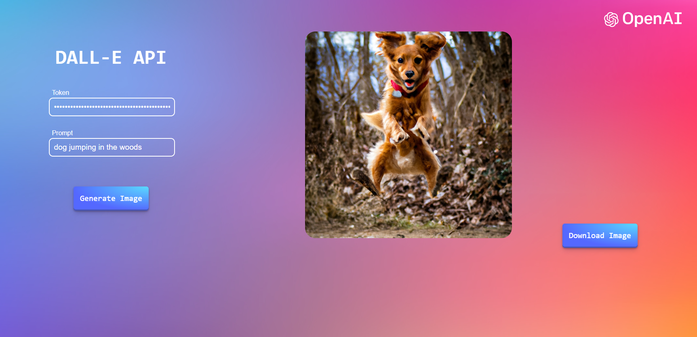

# DALL-E AI Image Generation Tool
Small website that generates images based on input text using Open AI's DALL-E API

Note: You must run the script from a local server, since opening the index.html file directly in the browser won't work.
 
You can use the VS Code Live Server extension in http://127.0.0.1:5500 or the http-server npm module in http://127.0.0.1:8080.
